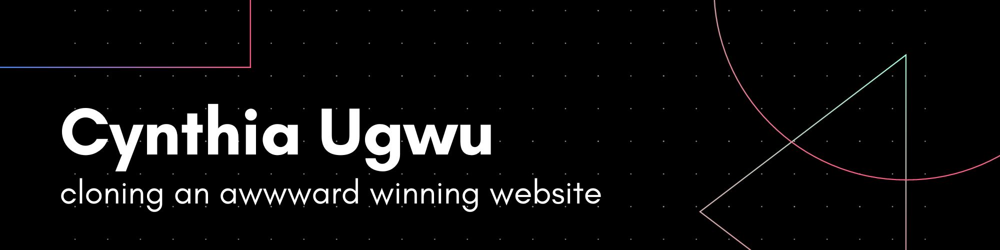
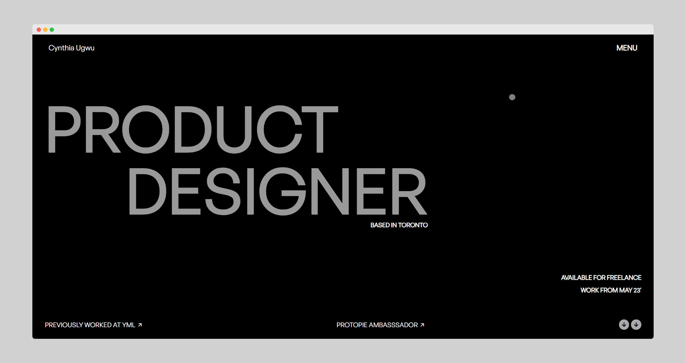
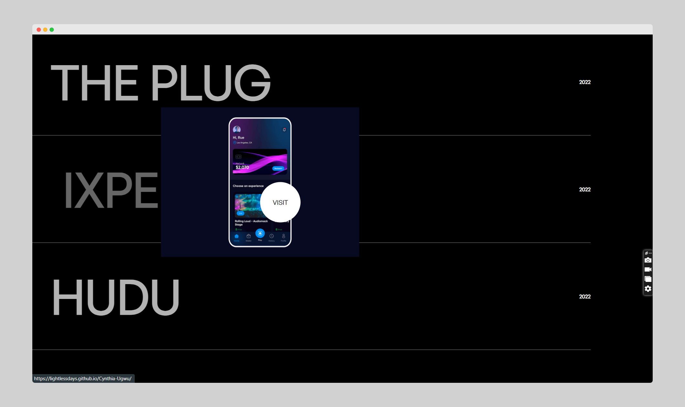
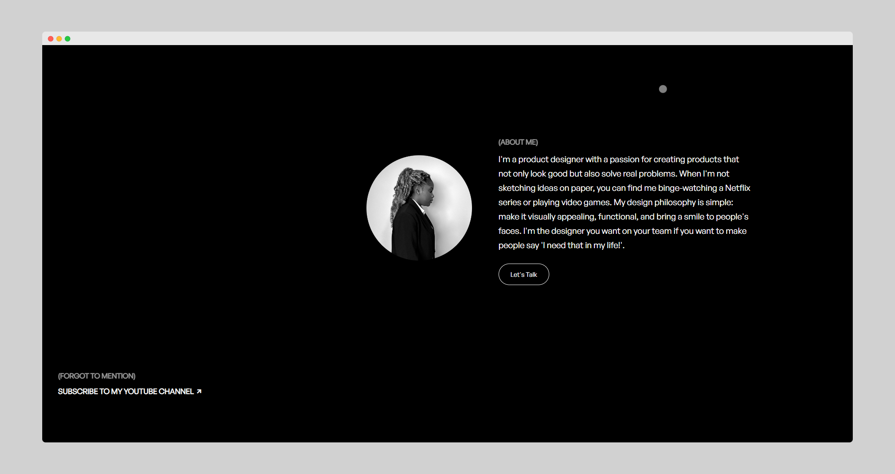

# Cynthia Ugwu - A Clone of Awwwards Website

Cynthia Ugwu's website has been featured in [Awwwards](https://www.awwwards.com/sites/cynthia-ugwu) and has won multiple awards for its simplicity. I have tried to clone this award-winning website in as minimal a way as possible. I have taken some artistic liberties while making the website to make the code run smoother. The following frameworks and languages have been used for this website:
- HTML
- JavaScript
- CSS
- SCSS
- GSAP Framework
- Locomotive Scroll Framework
- Git (for Version Control)

> ### _"My portfolio website aims to captivate and inspire visitors. With the primary objective of highlighting my skills, experience, and unique design approach." - Cynthia Ugwu_

## What to Look Out For?

The website is an Awwward-winning website, hence there would definitely be something to look out for. 
- Look out for the **entry animation** on the homepage.
- Look out for **Mouse Follower Circle** on desktop devices.
- Look out for the **Menu Section** that has a hover effect.

## Screenshots

